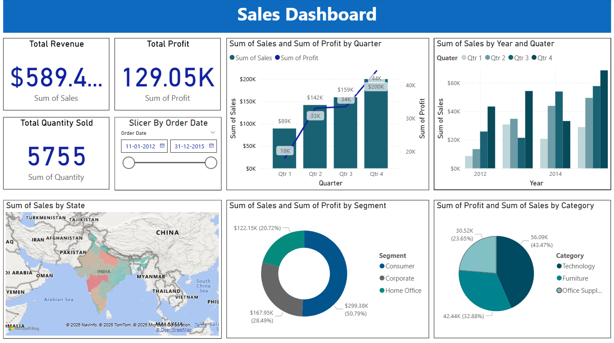
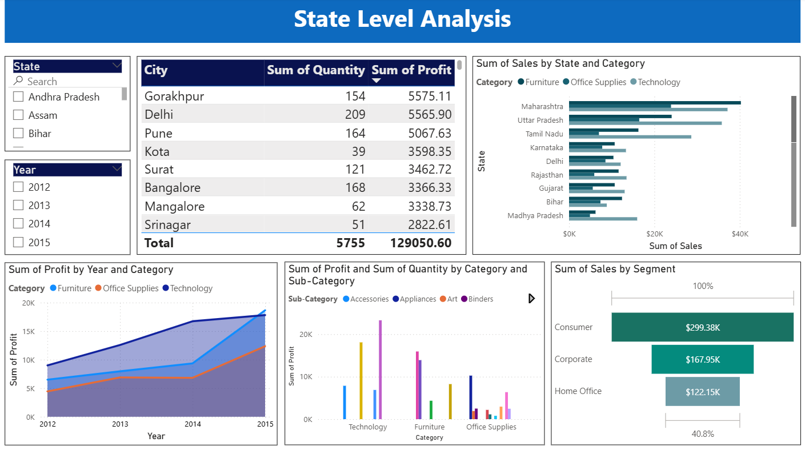
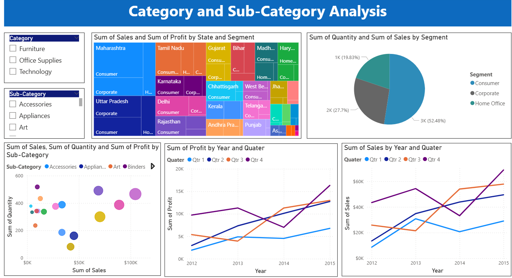

## 📌 Key Features

- KPIs: **Total Sales, Profit, and Quantity**
- Visuals: **Sales/Profit by Quarter, Year, State, and Category**
- **Map**, **Pie Charts**, **Line Graphs**, **Treemaps**, **Slicers**
- Drilldown capability with **state and segment filters**
- Cleaned and transformed using **Power Query Editor**
- DAX measures for performance tracking

## 🧠 Power BI Concepts Used

- Data Transformation (Power Query)
- Data Modeling & Relationships
- DAX Measures
- Interactive Filters/Slicers
- Custom Visuals

## 🖼️ Sample Screenshots

### 📌 Sales Dashboard

### 🧾 State Level Analysis

### 📂 Category & Sub-Category Analysis

## 💻 Tools Used

- Power BI Desktop
- Microsoft Excel / CSV for data
- DAX & Power Query

## 📥 How to Use

1. Clone or download the repository
2. Open `Superstore_Sales_Dashboard.pbix` in Power BI Desktop
3. Interact with slicers and visuals for dynamic insights

## 🔗 Demo

> Download the `.pbix` file and dataset to explore the dashboard locally.

## 🤝 Let's Connect

Feel free to reach out via [LinkedIn](https://www.linkedin.com/) or [GitHub Issues](https://github.com/) for feedback or collaborations.

---

© 2025 Telidevara Mahalakshmi – All Rights Reserved.
